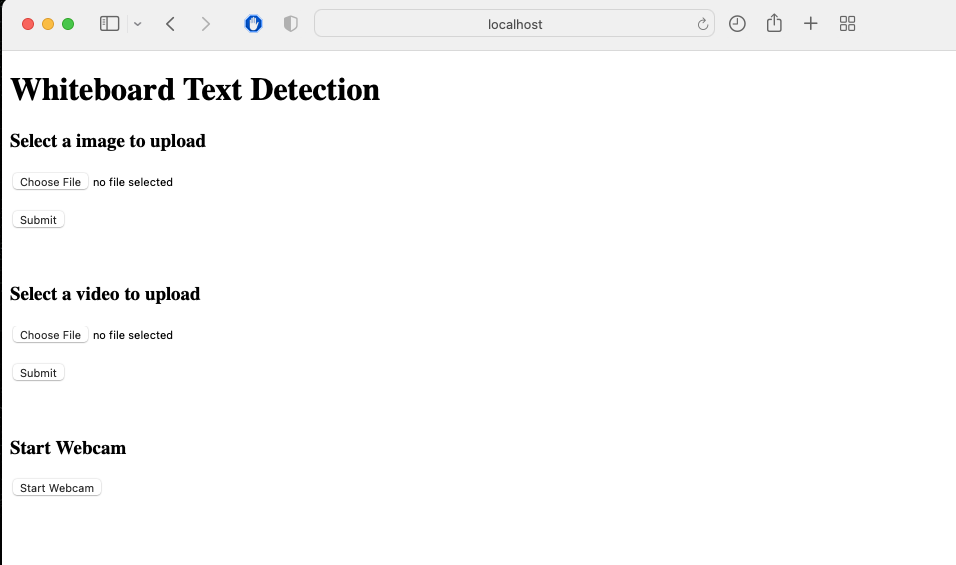
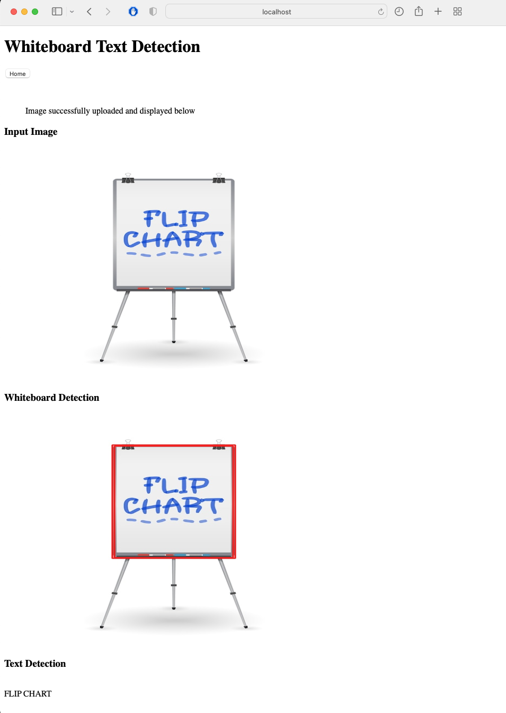

# Whiteboard Text Detection

This repository runs a python app to detect text from the uploaded images. 




Result of the uploaded image will have the detected whiteboard and text as shown below.



Once the image is uploaded, the user can click on `Home` button to go back and upload images, videos or start webcam. The future updates will include reading text from videos or webcam, the current implementation only displays the video uploaded.

----

## Approach

This is a flask app that uses OpenCV shape detection pipeline to find out whiteboards implemented in `detect_whiteboard` function in `engine.py`, and for each whiteboard (or rectangle) found it detects the text using the [EasyOCR](https://github.com/JaidedAI/EasyOCR) library.

I tried alternatives for EasyOCR such as PyTesseract, but the performance of EasyOCR was better in terms of detecting and recognizing the text.


## Setup

Python 3.X is required to run this application. To install the dependencies for the app, you can create a virtual environment using `virtualenv` or python's `venv`, and,

```bash
sh setup.sh
```

Note: 
1. For Windows EasyOCR, please install torch and torchvision first by following the official instructions [here](https://pytorch.org). On the pytorch website, be sure to select the right CUDA version you have. If you intend to run on CPU mode only, select CUDA = None.
2. If you don't mind little slower results, you can simply install EasyOCR directly and it will install the torch libraries for your CPU.


## Run the application

To run the application, 
```bash
python main.py
```


## Future Work and Improvements
1. Include functionality for video processing for videos and webcams.
2. EasyOCR is not very accurate for slightly or more blurry images. Can use a better OCR model.
3. Currently the app is tested on a non-GPU device, hence, with a GPU backend, the performance of the app can be faster.
4. OpenCV shape detection pipeline can be replaced by a very light (tflite, ONNX, TensorRT) object detector trained on whiteboard images.
5. The UI of the app can be more visually appealing with CSS.
